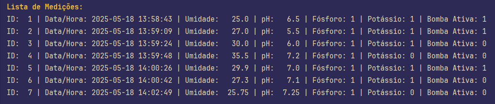

# README

# Sistema de Gerenciamento de Irrigação

## Modelo Entidade-Relacionamento (MER) Anterior

O MER anterior foi projetado para atender às necessidades do sistema de irrigação, com foco na entidade central `T_Medicoes`. Essa entidade armazena dados sensoriais coletados de sensores, incluindo `id_medicao` (chave primária, auto-incrementada), `data_hora` (para rastreamento temporal), `umidade` (valor real entre 0 e 100), `pH` (valor real entre 0 e 14), `fosforo` e `potassio` (valores binários, 0 ou 1), e `bomba_ativa` (calculado com base nas condições: umidade < 30, 5 ≤ pH ≤ 7, e presença de fósforo e potássio). A entidade `T_Configuracoes` foi incluída para armazenar parâmetros de configuração (como `limite_umidade`, `pH_min` e `pH_max`), mas não possui relação explícita com `T_Medicoes` no MER, funcionando como configuração global. A ausência de chaves estrangeiras reflete a simplicidade do sistema, permitindo medições independentes e escalabilidade para futuras expansões.

## Operações CRUD

O sistema implementa operações CRUD (Create, Read, Update, Delete) para gerenciar as medições de irrigação, utilizando o banco de dados SQLite (`irrigation.db`). Abaixo, as operações realizadas pelo script `CRUD.py` são detalhadas:

- **Create (Inserir)**: A função `simulate_wokwi_data()` coleta dados do usuário (umidade, pH, fósforo, potássio) e calcula o estado da bomba (`bomba_ativa`). Esses dados são inseridos na tabela `T_Medicoes` com a data e hora atuais. Exemplo: um registro com umidade 25.0, pH 6.5, fósforo 1, potássio 1 e bomba ativa 1 foi inserido em 2025-05-18 13:58:43.
- **Read (Consultar)**: A função `read_medicoes()` exibe todas as medições armazenadas na tabela `T_Medicoes`, listando cada registro com seus atributos (ID, data/hora, umidade, pH, fósforo, potássio e bomba ativa). Isso permite verificar os dados inseridos ou atualizados.
- **Update (Atualizar)**: A função `update_medicao()` permite ao usuário modificar uma medição existente com base no `id_medicao`. O usuário pode atualizar umidade, pH, fósforo e potássio, e o sistema recalcula o estado da bomba com base nos novos valores. Exemplo: atualizar a medição com ID 1 para umidade 28.0 mantém a bomba ativa se as condições ainda forem atendidas.
- **Delete (Deletar)**: A função `delete_medicao()` remove uma medição da tabela com base no `id_medicao` fornecido. Exemplo: deletar a medição com ID 2 remove o registro correspondente sem afetar os demais.

## Justificativa da Estrutura de Dados e Relação com o MER da Fase 2

### Estrutura Implementada

O banco de dados foi desenvolvido usando SQLite, com duas tabelas principais:

- **T_Medicoes**: Contém os campos id_medicao (chave primária autoincremental do tipo INTEGER), data_hora (DATETIME para registrar o momento da medição), umidade (REAL, variando de 0 a 100%), pH (REAL, de 0 a 14), fosforo (INTEGER, 0 ou 1), potassio (INTEGER, 0 ou 1) e bomba_ativa (INTEGER, 0 ou 1). Essa tabela armazena o histórico de dados captados pelos sensores simulados do ESP32.
- **T_Configuracoes**: Inclui id_config (chave primária autoincremental do tipo INTEGER), limite_umidade (REAL), pH_min (REAL) e pH_max (REAL), armazenando os parâmetros de controle da irrigação, como o limite de umidade e a faixa aceitável de pH.

### Relação com o MER da Fase 2

A entidade central, T_Medicoes, reflete a necessidade de armazenar dados sensoriais (umidade, pH, presença de fósforo e potássio) e o estado da bomba, com atributos como id_medicao (chave primária para unicidade), data_hora (para histórico temporal), e bomba_ativa (decidido por regras lógicas baseadas nos sensores), conforme o código CRUD.py. A escolha de atributos numéricos e booleanos (ex.: fosforo e potassio como 0 ou 1) facilita cálculos e atualizações, como na função update_medicao, que recalcula bomba_ativa dinamicamente. A ausência de chaves estrangeiras sugere uma entidade independente, adequada para medições autônomas, mas flexível para futura expansão. Essa estrutura simples e eficiente suporta as operações CRUD e a lógica de controle da bomba, alinhando-se às exigências do sistema.

### Justificativa da Escolha

- **SQLite**: A escolha do SQLite se deve à sua leveza, integração nativa com Python via sqlite3 e adequação para um sistema local de irrigação, eliminando a necessidade de um servidor de banco de dados.
- **T_Medicoes**: Os campos foram desenhados para espelhar os dados enviados pelo ESP32 via serial (simulado no Wokwi), garantindo compatibilidade com o formato estruturado. O uso de AUTOINCREMENT em id_medicao facilita a identificação única de registros.
- **T_Configuracoes**: Separa os parâmetros fixos (limite de umidade, faixa de pH) dos dados dinâmicos, permitindo ajustes centralizados na lógica de controle da bomba. Isso reflete a necessidade de flexibilidade no sistema.
- A estrutura suporta as operações CRUD e atende à meta de armazenar automaticamente os dados do ESP32, alinhando-se ao objetivo do projeto e ao MER da Fase 2.

---

### Tabelas de exemplo com os dados usados;

| ID  | Data/Hora           | Umidade | pH   | Fósforo | Potássio | Bomba Ativa |
| --- | ------------------- | ------- | ---- | ------- | -------- | ----------- |
| 1   | 2025-05-18 13:58:43 | 25.0    | 6.5  | 1       | 1        | 1           |
| 2   | 2025-05-18 13:59:09 | 27.0    | 5.5  | 1       | 1        | 1           |
| 3   | 2025-05-18 13:59:24 | 30.0    | 6.0  | 1       | 1        | 0           |
| 4   | 2025-05-18 13:59:48 | 35.5    | 7.2  | 1       | 0        | 0           |
| 5   | 2025-05-18 14:00:26 | 29.9    | 7.0  | 1       | 1        | 1           |
| 6   | 2025-05-18 14:00:42 | 27.3    | 7.1  | 1       | 1        | 0           |
| 7   | 2025-05-18 14:02:49 | 25.75   | 7.25 | 1       | 0        | 0           |

## 

# Sistema de Controle de Irrigação com ESP32

Projeto para automação de irrigação baseada em condições ambientais, com segurança por ativação manual dupla.

---

## 🔍 Lógica de Funcionamento da Bomba

**A bomba liga somente se TODAS estas condições forem atendidas simultaneamente:**

1. **Umidade abaixo de 30%**  
   _(Medida pelo sensor DHT22)_

2. **pH entre 5 e 7**  
   _(Simulado pela leitura do LDR)_

3. **Botões P (Fósforo) e K (Potássio) pressionados**  
   _(Ativação manual consciente)_

---

## ❓ Por Que Esses Parâmetros?

### 1. Umidade ≤ 30%

- **Motivo Técnico**: Valor seguro para evitar encharcamento em culturas semiáridas (ex: cactos, lavanda)
- **Base Científica**: Nível comum em sistemas de irrigação conservativa ([FAO, 2022](https://www.fao.org))
- **Flexibilidade**: Pode ser ajustado para:
  ```cpp
  // Modifique no código:
  if (umidade < 30) → if (umidade < SEU_VALOR)
  ```

````

### 2. pH 5-7

- **Importância Agronômica**: Faixa ideal para maioria das plantas:
  - **5-6.5**: Hortaliças (tomate, batata)
  - **6-7**: Grãos (feijão, trigo)
- **Segurança Química**: Evita danos por acidez/alcalinidade extrema
- **Observação**: O LDR simula um sensor de pH real - para uso prático:
  ```cpp
  // Calibre com valores reais:
  float pH = map(valorLDR, MIN_LDR, MAX_LDR, 0, 14);
  ```

---

## ⚙️ Calibração Recomendada

| Parâmetro | Valores Padrão | Ajuste Recomendado           |
| --------- | -------------- | ---------------------------- |
| Umidade   | 30%            | 20-40% conforme tipo de solo |
| pH        | 5-7            | 4.5-7.5 para plantas ácidas  |
| Pressão   | Botão físico   | Add delay(200) para debounce |

---

## ✅ Como Usar

1. Pressione **ambos botões** simultaneamente
2. Sistema verifica automaticamente:
   - Umidade do ar
   - Nível de pH simulado
3. Bomba mantém-se ligada **enquanto**:
   - Condições ambientais forem atendidas
   - Botões estiverem pressionados

---

## 🛠 Melhorias Futuras

- [ ] Adicionar display LCD para valores em tempo real
- [ ] Implementar ativação por temporizador
- [ ] Integrar com sensor de pH profissional
- [ ] Adicionar modo IoT (WiFi/Blynk)


````
